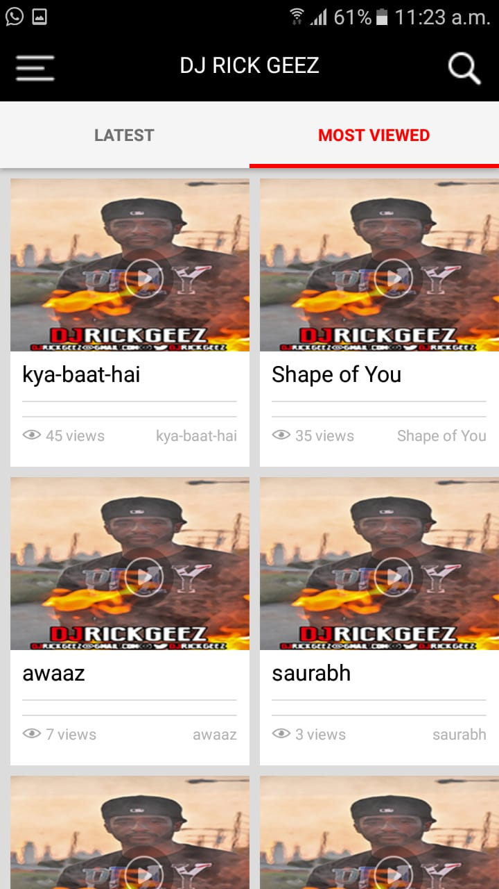
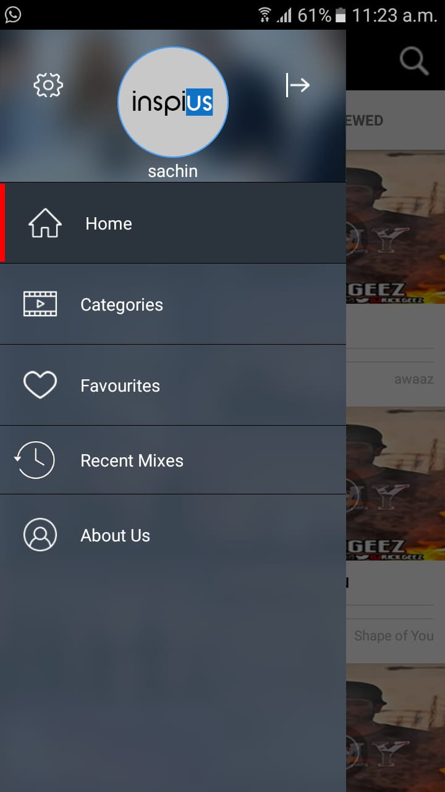

# Music streaming app build on NativeScript and Open Age

It uses following API's of Open Age

- [Directory](http://open-age-docs.m-sas.com/blog/2018/05/03/employee-directory/)
- [Drive](http://open-age-docs.m-sas.com/blog/2018/07/27/docs/)

## Screenshots

## Walkthrough

### Architecture
The application component:
- `app.component.ts` - sets up a page router outlet that lets you navigate between pages.

There is a single blank component that sets up an empty page layout:
- `/home`

**Home** page has the following components:
- `ActionBar` - It holds the title of the page.
- `GridLayout` - The main page layout that should contains all the page content.

## Get Help
The NativeScript framework has a vibrant community that can help when you run into problems.

Try [joining the NativeScript community Slack](http://developer.telerik.com/wp-login.php?action=slack-invitation). The Slack channel is a great place to get help troubleshooting problems, as well as connect with other NativeScript developers.

If you have found an issue with this template, please report the problem in the [NativeScript repository](https://github.com/NativeScript/NativeScript/issues).

## Contributing

We love PRs, and accept them gladly. Feel free to propose changes and new ideas. We will review and discuss, so that they can be accepted and better integrated.
